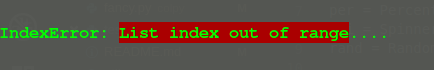

# colpy 0.0.3
Add color highlights, load bars, progress displays and style to your python scripts and shell sessions

[Colpy Gist](https://gist.github.com/BlankGodd/9457548d94925de245f9a9bbcc1c3f02)

## Applications
- Highlight 
  - special texts
  - errors
        
- Create
  - Custom buttons or list bullet styles

  - Progress bars
    - Multi-styled loading bars
    - Percentage progress display
    - Spinner progress display
    - Random load bar
    - Download bar 

## Usage
To use, install package using pip
```
$ pip3 install colpy
```
### Using Progress bars

 

Progress bars are used to tell how far or how long a process has gone or taken and 
how much is left to be done

It highlighs the lenght of the total procress and the time take to complete

Progress bars are best used when a user wants to iterate over a number of values
and perform actions on those values while taken note of the average time elapsed and
getting an idea of the time left for a process to reach completion.

Import package into python script or shell environment
```py
from colpy import *
# or single imports
from colpy import Load_bar

# Using a custom load bar

# The lenght indicates the size of the fullbar or the number of
# single bars  
loadbar = Load_bar(name="Processing...", length=20, style='$')
"""
The load bar can be loaded with the parameters absent
This makes the Load_bar use its default values
name = Loading...
length = 20
style = #

i.e
"""
loadbar = Load_bar()

# to iterate over an iterable, it is best if its length
# is a multiple of the the length of the bar
# For instance if we have a list of 30 items
# we could do
loadbar = Load_bar(length=10) # or 15 as the case may be

# to iterate over the list
# say

lst = [i for i in <whatever>]
# or 
string = 'some long string to be worked on'
# or 
val = 100

# we do
for i in loadbar.iter(lst): # or string or val
    # do some work on i

```

The same method applies for the following
But here, the styles are fixed and can't be changed
```py
darkbar = Dark_bar()
circlebar = Circle_bar()
squarebar = Square_bar()
```

### Using the random bar
```py
randombar = Random_bar()
# the name paramenter can be changed or left as default
randombar = Random_bar(name='Downloading... ')

# to use, call the iter method with the iterable
for i in random.iter(val):
    # do some work on (i)
```

### Using the Spinner and percent
```py
spinner = Spinner()
# the name paramenter can be changed or left as default
spinner = Spinner(name='Authenticating... ')

# to use, call the iter method with the iterable
# support for a next() method will be available in future versions
for i in spinner.iter(val):
    # do some work on (i)

# the same process works for percent
percent = Percent()
```

##### Support for a next() method for progress bars will be available in future versions

### Adding Highlights
Note: Highlights are best used with the pring function

#### Creating a botton or bullet style

 

Available botton states
['x','=','+','*','~','$','#','@',' ','-']

Available colors
['red','green','orange','blue','purple','lightblue','cyan']

```py
from colpy import Botton

# to add button
# the ind parameter represents the index of the botton state on the list
# of available botton states. Remember indexing in python starts at 0
# default index is zero, default color is red
# default outer is True

# outer (a boolean) determines if the botton should have an outer shell
# or not i.e '[x]' or 'x'

but = button(ind=2,color='lightblue')
message = 'text text text'
print(but + message)
```

#### Changing text color and background

CHANGING TEXT COLOR

 

When text color is to be changes, the text to be printed out should be 
printed the the colpy cprint(txt=text,color='purple') method

This prints out the text with the intended color
```py
# An example
# for a list of values to be printed out
for i in list:
    cprint(txt=i, color='orange')
```
This prints out the test in the specified color

CHANGING BACKGROUND

 

The background of a text can be changes to highligh parts of texts,
show errors among other things

Available colors
['black','red','green','orange','blue','purple','lightblue','cyan']
```py
# An example
err = 'List index out of range'
error = highlight(txt=err,color='red')
print('IndexError: ' + error + '....')
```

## Note
- kindly share with friends :smiley:
- Thank you for using :smile:
- If there is any problem, you can open an issue :grey_question:
- Leave us a star :star:

## Contributor(s)
**[@BlankGodd](https://github.com/BlankGodd)**